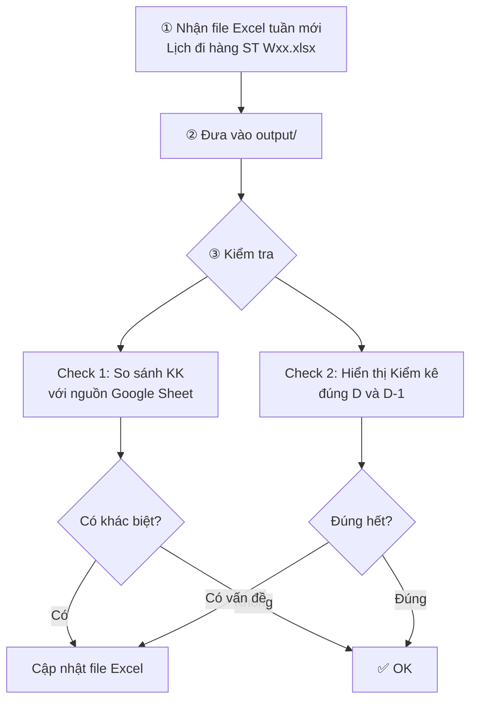

# Lịch Đi Hàng DC — Workflow Hàng Tuần

> Mỗi tuần tạo 1 file `Lịch đi hàng ST W{xx}.xlsx`, kiểm tra đối chiếu với nguồn Google Sheet.

---

## Cấu trúc thư mục

```
LICH DI HANG DC/
├── output/                     ← File Excel lịch đi hàng mỗi tuần
│   ├── Lịch đi hàng ST W14.xlsx
│   ├── Lịch đi hàng ST W15.xlsx
│   └── Lịch đi hàng ST W16.xlsx   ← file tuần hiện tại
├── script/
│   ├── check_kk_display.py     ★ Kiểm tra hiển thị "Kiểm kê" đúng D / D-1
│   └── compare_kk_w16_live.py  ★ So sánh KK với nguồn Google Sheet
├── data/
├── context/
└── WORKFLOW.md                 ← File này
```

---

## Flow hàng tuần



---

## Chi tiết từng bước

### ① Nhận file Excel tuần mới

- File tên: `Lịch đi hàng ST W{số tuần}.xlsx`
- Chứa 2 sheet quan trọng:

| Sheet | Nội dung |
|-------|----------|
| **KK** | Danh sách store + ngày kiểm kê (col A=ID, B=KV, C=Tên ST, D=Ngày KK) |
| **Lịch về hàng** | Lịch giao hàng theo ngày, row 3 col 8-14 = T2→CN |

### ② Đưa file vào `output/`

Copy file Excel vào `LICH DI HANG DC/output/`

### ③ Kiểm tra

#### Check 1 — So sánh lịch KK với nguồn Google Sheet

**Yêu cầu Gemini:**
> "Fetch lại nguồn Google Sheet kiểm kê rồi so sánh với file W{xx}"

**Nguồn:**
```
https://docs.google.com/spreadsheets/d/1KIXDqGDW60sKNXuHOriT8utPTyhV-pCy11jlf18Zz-0/gviz/tq?tqx=out:csv&gid=220196646
```

**So sánh gì:**
| Trường | Cách so |
|--------|---------|
| Ngày KK | Normalize `dd/mm/yyyy` rồi so exact |
| KV | So exact string |

**Kết quả cần chú ý:**

| Nhóm | Hành động |
|------|-----------|
| ✅ Khớp | Không cần làm gì |
| ⚠️ Khác KV/Ngày | Kiểm tra bên nào đúng → cập nhật |
| 🔴 Thiếu trong file Wxx | **Bổ sung vào Excel** |
| ℹ️ Chỉ có trong Wxx | Thường do nguồn chỉ hiện store sắp KK → bình thường |

---

#### Check 2 — Hiển thị "Kiểm kê" đúng D / D-1

**Yêu cầu Gemini:**
> "Check sheet lịch về hàng hiển thị đúng ngày kiểm kê chưa"

**Rule:**
- Store có KK ngày **D** → cột ngày **D** và cột ngày **D-1** phải ghi "Kiểm kê"
- Chỉ kiểm tra các ngày trong tuần (col 8-14, row 3)

**Kết quả:**
- ✅ Đúng → OK
- ❌ Thiếu → Sửa lại trong Excel, thêm "Kiểm kê" vào ô tương ứng

---

## Lưu ý

> [!WARNING]
> - Nguồn Google Sheet là **dynamic** — chỉ hiện stores sắp KK, không phải toàn bộ lịch năm
> - Mỗi lần check cần **fetch lại** nguồn mới nhất (dữ liệu thay đổi liên tục)

> [!TIP]
> Script hiện tại hardcode tên file `W16`. Khi chuyển tuần mới, nói Gemini đổi sang Wxx tương ứng.
