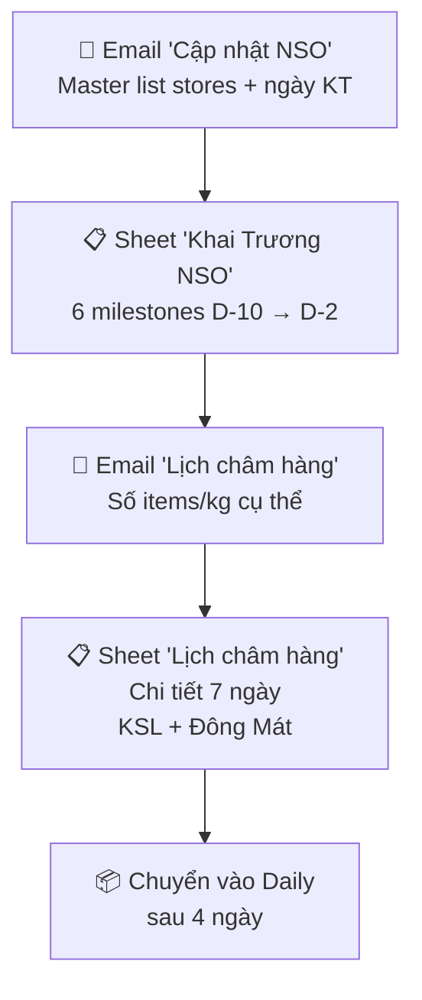

# Phân tích Tổng hợp — Lịch Khai Trương NSO

> Nguồn dữ liệu đã đọc:
> 1. [Google Sheet - Lịch châm hàng](https://docs.google.com/spreadsheets/d/16Q-E4WFr6fAn_ywf2OTgPFZlVhsqMm_S_2cNkCwD2EE/edit?gid=46988561)
> 2. [Google Sheet - Khai Trương NSO](https://docs.google.com/spreadsheets/d/16Q-E4WFr6fAn_ywf2OTgPFZlVhsqMm_S_2cNkCwD2EE/edit?gid=1254277178)
> 3. Email Haraworks: **Fwd: Cập nhật NSO - 2026** (Lương Thị Hương Giang, 13/04)
> 4. Email Haraworks: **LỊCH CHÂM HÀNG NSO A161, A148, A179, A177** (Phạm Tú Nhi, 13/04)
> 5. Email Haraworks: **Lịch về hàng NSO KFM_HCM_Q07** (Tâm, 14/04)

---

## 1. Sheet "Lịch châm hàng" — Chi tiết giao hàng tuần đầu

### Mục đích
Lịch **châm hàng DRY (KSL) + Đông Mát** cho siêu thị mới khai trương — giai đoạn 7 ngày đầu.

### Cấu trúc (mỗi store = 1 block 5 dòng)

| Dòng | Nội dung |
|------|----------|
| Header 1 | `Store` / `Ngày` → 7 cột ngày / `Total` |
| Header 2 | _(blank)_ / `Chuyển` → Thứ / _(blank)_ |
| Data KSL | Tên store / `KSL (22:00-24:00PM) items` → số items/ngày / **Total** |
| Data ĐM | _(blank)_ / `Đông Mát ITL(13:00-14:00PM) Kg` → kg/ngày / **Total** |
| Blank | separator |

### Dữ liệu hiện tại

| Store | Code | Khai trương | KSL Items | Đông Mát Kg |
|-------|------|------------|-----------|-------------|
| The Park Residence | A161 | 17/04 | 2800→4200→2800→2300→Daily×3 = **12,100** | 400 |
| 127 Tân Cảng | A148 | 17/04 | 2800→4200→2800→2300→Daily×3 = **12,100** | 400 |
| Him Lam Phú An | A179 | 17/04 | 1800→3000→1800→1500→Daily×3 = **8,100** | 400 |
| Sky Garden 2-R1-2 | A177 | **18/04** | 1800→3000→1800→1500→Daily×3 = **8,100** | 400 |

### Quy tắc chia hàng
- **4 ngày đầu**: Theo plan cố định (trưa 2k + tối theo version)
- **3 ngày cuối**: Chuyển vào "Daily" (team cắt số daily, không đi riêng nữa)

---

## 2. Sheet "Khai Trương NSO" — Timeline milestones

### Cấu trúc
- **Layout ngang**: Mỗi store chiếm 3 cột (Thời gian / Ngày / Thứ)
- **6 milestones** (D = ngày khai trương):

| Row | Milestone | Thời gian | Offset |
|-----|-----------|-----------|--------|
| 3 | Gửi số chia hàng đợt 1 (70-80%) | Trước 17:30PM | ~D-10 |
| 4 | Gửi số chia hàng đợt 2 (20-30%) | Trước 12:00AM | ~D-6 |
| 5 | KSL chốt phiếu khai trương | Tối | ~D-5 |
| 6 | _(dòng phụ milestone 5)_ | Trước 6:00AM | ~D-4 |
| 7 | **OPS kiểm hàng D-3** *(đỏ)* | Sáng | D-3 |
| 8 | **DC chuyển hàng D-2** *(đỏ)* | Tối | D-2 |

---

## 3. Email "Fwd: Cập nhật NSO - 2026" — Master list

### Nội dung chính
Email chứa **bảng tổng hợp toàn bộ stores sắp khai trương**, bao gồm:
- STT, Mã ST, Tên/Địa chỉ, Trạng thái thi công, Ngày nhận mặt bằng, Ngày khai trương

### Stores sắp khai trương (tháng 4-5/2026)

| STT | Code | Tên ST | Trạng thái | Nhận MB | Khai trương |
|-----|------|--------|------------|---------|-------------|
| 160 | A161 | The Park Residence | Đã kí, đang thi công | 15/03 | **17/04** (T6) |
| 161 | A148 | 127 Tân Cảng | Đã kí, đang thi công | 01/04 | **17/04** (T6) |
| 162 | A179 | Him Lam Phú An | Đã kí, đang thi công | 01/04 | **17/04** (T6) |
| 163 | A177 | Sky Garden 2 | Đã kí, đang thi công | 01/04 | **18/04** (T7) |
| 164 | A164 | Opal Boulevard | Đã kí, đang thi công | 01/04 | **23/04** (T5) |
| 165 | A185 | VHGP Q9 - BS1501 | Đã kí, đang thi công | 01/04 | **23/04** (T5) |
| 166 | A178 | Celesta Rise G16 | Đã kí, đang thi công | 01/04 | **24/04** (T6) |
| 167 | A191 | 35-37 Nguyễn Hữu Cầu | - | 06/04 | **24/04** (T6) |
| 168 | A176 | Sunrise Riverside | Đã kí, đang thi công | 01/04 | **24/04** (T6) |
| 169 | A163 | Celadon Boulevard | - | 07/04 | **25/04** (T7) |
| 170 | A167 | Shophouse 9 View | - | 06/04 | **25/04** (T7) |
| 171 | A192 | 61 Bùi Đình Túy | - | 15/04 | **25/04** (T7) |
| 172 | A186 | Melody Residence | Dời trễ 1 tuần | 10/04 | **07/05** |
| 174 | A181 | Masterise Center Point | Dời trễ 1 tuần | 10/04 | **07/05** |
| 175 | A175 | Golden Mansion 119 Phổ Quang | Đã kí, đang thi công | 15/04 | 15/05 |
| 176 | A189 | 91-93 Nguyễn Sơn | Đã kí, chưa thi công | 15/04 | 15/05 |
| 177 | A171 | 819-821 Phạm Thế Hiển | Đã kí, chưa thi công | 15/04 | 08/05 |
| 178 | A190 | BOTANICA PREMIER | Đã kí, đang thi công | 01/05 | 09/05 |
| 179 | A188 | CC Thuận Việt | Đã kí, đang thi công | 13/04 | 09/05 |
| 180 | A184 | Saigon Mia - L1-08 | Đã kí, chưa thi công | 15/04 | 15/05 |
| ... | ... | _(tiếp tục đến tháng 9/2026)_ | ... | ... | ... |
| 192 | A135 | 1652 Huỳnh Tấn Phát (FPT) | Đã kí, chưa thi công | 01/09 | 25/09 |

### Thay đổi quan trọng
> [!WARNING]
> - **Melody & Masterise Center Point**: Dời trễ 1 tuần → khai trương **07/05/2026**
> - **Đường A4 - TBI**: Store mới bổ sung vào lịch

---

## 4. Email "LỊCH CHÂM HÀNG NSO A161, A148, A179, A177" — Số lượng chi tiết

Từ Phạm Tú Nhi (13/04), xác nhận lịch châm hàng cụ thể cho 4 stores:
- **A161 & A148**: 2800 → 4200 → 2800 → 2300 → Daily
- **A179**: 1800 → 3000 → 1800 → 1500 → Daily
- **A177**: Bắt đầu từ **18/04** (lệch 1 ngày)

---

## 5. Tổng quan Flow

---

## 6. Câu hỏi cho anh

> [!IMPORTANT]
> Đã đọc xong tất cả. Giờ anh muốn t làm gì cụ thể?

Một số hướng đề xuất:

1. **Tạo file Excel "Lịch khai trương Wxx.xlsx"** — tổng hợp stores khai trương trong tuần, với timeline milestones + lịch châm hàng
2. **Script fetch + alert** — Tự động check ngày hôm nay cần làm gì (gửi số đợt 1? KSL chốt phiếu? OPS kiểm hàng?)
3. **Dashboard tổng hợp** — Xem toàn bộ pipeline NSO sắp tới
4. **Inject vào file Lịch đi hàng ST Wxx.xlsx** — Thêm thông tin châm hàng NSO vào file lịch tuần hiện có
