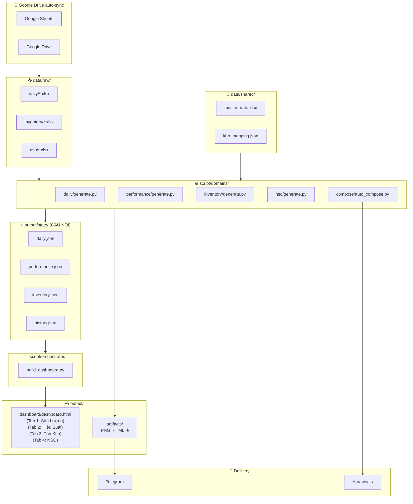
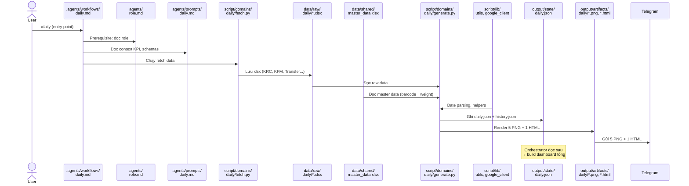

# 🚛 Transport Daily Report

**Hệ thống báo cáo & tự động vận hành logistic hàng ngày — SCM Team**

---

## Tổng Quan

Dự án gồm 4 module, chạy **hàng ngày** trên máy local sync Google Drive:

| Module | Slash Command | Output |
|--------|---------------|--------|
| **Daily Report** | `/daily-report` | HTML dashboard + 5 PNG → Telegram |
| **Performance Report** | `/performance-report` | HTML dashboard + Excel raw data |
| **Compose Mail** | `/compose-mail` | HTML email → Haraworks draft |
| **Backup Inject** | `/backup-inject` | Inject thủ công sau cutoff |

### Các kho vận hành

| Kho | Lịch giao | Ghi chú |
|-----|-----------|---------| 
| **KRC** | 7/7 | — |
| **THỊT CÁ** | 7/7 | — |
| **ĐÔNG MÁT** | 6/7 | Không giao Thứ 2 |
| **KSL (DRY)** | 6/7 | Không giao CN (ngoại lệ khai trương) |

---

## Cấu Trúc Thư Mục Hiện Tại

```
transport_daily_report/
│
├── .agents/workflows/          ← ENTRY POINT (slash commands)
│   ├── daily-report.md
│   ├── compose-mail.md
│   ├── backup-inject.md
│   └── performance-report.md
│
├── agents/                     ← 🧠 AI BRAIN
│   ├── role.md
│   └── prompts/                  Context chi tiết per task
│
├── script/                     ← ⚙️ CODE
│   ├── lib/                      📦 Shared library
│   │   ├── __init__.py
│   │   ├── telegram.py           Telegram send/delete (requests + urllib)
│   │   └── sources.py            Centralized data source URLs & paths
│   │
│   ├── domains/                  🏢 Domain-specific scripts
│   │   ├── daily/generate.py       Daily transport report
│   │   ├── inventory/generate.py   Inventory reconciliation (KFM vs ABA)
│   │   ├── nso/generate.py         NSO dashboard & schedule
│   │   └── performance/           Performance KPI reports
│   │       ├── generate.py
│   │       ├── fetch_weekly.py
│   │       └── fetch_monthly.py
│   │
│   ├── orchestrator/             🎛️ Cross-domain orchestration (future)
│   │
│   └── compose/                  📧 Email orchestration
│       ├── auto_compose.py         Orchestrator (watch + schedule)
│       ├── compose_mail.py         Generate HTML email
│       └── inject_haraworks.py     Selenium → Haraworks
│
├── data/                       ← 📥 INPUT (auto-saved, gitignored)
│   ├── raw/{daily,inventory}/    Backups from online sources
│   ├── processed/                Cleaned data for dashboard
│   └── shared/                   Cross-domain shared data
│
├── output/                     ← 📤 OUTPUT (gitignored)
│   ├── artifacts/{daily,inventory,nso}/
│   ├── dashboard/                Multi-tab centralized dashboard
│   └── state/                    Telegram message tracking
│
├── config/                     ← ⚙️ CONFIG
│   ├── telegram.json               Daily bot config
│   ├── telegram_inventory.json     Inventory bot config
│   ├── telegram_nso.json           NSO bot config
│   ├── mail_schedule.json
│   └── auto_compose_task.xml
│
└── README.md
```

---

## Workflows (Quick Reference)

### 1. Daily Report `/daily-report`
```powershell
python -u script/domains/daily/generate.py --send
python -u script/domains/daily/generate.py --date DD/MM/YYYY --send
```

### 2. Compose Mail `/compose-mail`
```powershell
python -u script/compose/auto_compose.py --watch
python -u script/compose/auto_compose.py --status
```

### 3. Performance Report `/performance-report`
```powershell
python -u script/domains/performance/fetch_monthly.py --month 04 --year 2026
python -u script/domains/performance/generate.py --months 3,4 --year 2026
```

### 4. Backup Inject `/backup-inject`
```powershell
python -u script/compose/auto_compose.py --status
python -u script/compose/compose_mail.py --kho KRC --date DD/MM/YYYY
python -u script/compose/inject_haraworks.py --kho KRC --date DD/MM/YYYY --week W16
```

---

## 🌐 Live Dashboard (GitHub Pages)

**URL: https://tunhipham.github.io/transport_daily_report/**

Dashboard web thống nhất 4 tab, team bookmark link này xem report mới nhất.

### Kiến trúc

```
Domain Scripts (daily/perf/inv/nso)
    ↓  generate reports
    ├──→ Telegram (HTML/PNG) ← giữ nguyên
    └──→ export JSON → docs/data/*.json
                            ↓  git push
                     GitHub Pages (live web)
                            ↓
                     Team mở link xem 🎯
```

### 4 Tabs

| Tab | Nội dung | Update khi nào |
|-----|----------|----------------|
| 📦 **Daily** | Tấn/Xe/ST/Items, table theo kho, trend charts, donut | Sau daily report |
| 🚛 **Performance** | SLA/Plan/Route/KH, 5 charts + filters, weekly tables | Sau perf report |
| 📋 **Inventory** | Item/SKU/KG accuracy, trend charts, pie | Sau inventory report |
| 🏪 **NSO** | Store stats, calendar, replenishment schedule | Thứ 3 sau NSO task |

### Cách update dashboard

```powershell
# Sau daily report
python script/dashboard/deploy.py --domain daily

# Sau performance report
python script/dashboard/deploy.py --domain performance

# Sau inventory report
python script/dashboard/deploy.py --domain inventory

# Sau NSO task (thứ 3)
python script/dashboard/deploy.py --domain nso

# Update tất cả
python script/dashboard/deploy.py --domain all
```

Mỗi lệnh sẽ: **Export JSON** → `git add docs/` → `git commit` → `git push` → GitHub Pages tự deploy (~1-2 phút).

### Files

| File | Mục đích |
|------|----------|
| `docs/index.html` | SPA dashboard (4 tabs, Chart.js, dark theme) |
| `docs/data/*.json` | Data files cho mỗi domain |
| `script/dashboard/export_data.py` | Export JSON từ state/cache files |
| `script/dashboard/deploy.py` | Export + git push tự động |

> 💡 **Lưu ý**: Máy không cần bật 24/7. Chỉ cần chạy `deploy.py` sau mỗi report. GitHub lo hosting.

---

## Tech Stack

| Component | Technology |
|-----------|-----------|
| Language | Python 3 |
| Data | `openpyxl`, `requests` |
| Browser fetch | `playwright` |
| Email inject | `selenium` + Edge WebDriver |
| Charts | SVG (server) + Chart.js (client) |
| Notifications | Telegram Bot API |
| Scheduling | Windows Task Scheduler |
| Storage | Google Drive sync |
| VCS | Git → GitHub (`tunhipham/transport_daily_report`) |

### Prerequisites
```powershell
pip install openpyxl requests playwright selenium
playwright install chromium
```
- **Working directory**: `G:\My Drive\DOCS\transport_daily_report`
- **Edge profile**: `.edge_automail/` (auto-created)
- **Haraworks login**: SC012433

---

## 🏗️ Kiến Trúc Tổng Thể — Monorepo

### Hiện tại → Mục tiêu

| | Hiện tại (3 folders riêng) | Mục tiêu (1 monorepo) |
|---|---|---|
| **Projects** | `transport_daily_report`, `ton_aba`, `LICH DI HANG DC` | `logistics/` (1 repo) |
| **Config** | 3 telegram.json riêng | 1 telegram.json chung |
| **Shared code** | Trùng lặp (fetch, telegram) | `lib/` dùng chung |
| **Dashboard** | 3 HTML riêng | **1 HTML, nhiều tabs** |
| **Master data** | Mỗi project tự copy | **1 bản duy nhất** |

---

### Target Folder Structure

```
logistics/                                    ← 1 MONOREPO DUY NHẤT
│
├── .agents/workflows/                        ← ❗ ENTRY POINT
│   ├── daily.md                                 /daily
│   ├── performance.md                           /performance
│   ├── inventory.md                             /inventory
│   ├── compose.md                               /compose
│   └── dashboard.md                             /dashboard (trigger build)
│
├── agents/                                   ← 🧠 AI BRAIN
│   ├── role.md                                  Role chung
│   └── prompts/
│       ├── daily.md                             Data schemas, KPI, charts
│       ├── performance.md                       SLA windows, trip data
│       ├── inventory.md                         Đối soát KFM vs ABA
│       ├── compose.md                           Mail rules, schedule
│       └── dashboard.md                         Logic render dashboard
│
├── script/
│   ├── domains/                              ← ⚙️ DOMAIN SCRIPTS (xử lý riêng)
│   │   ├── daily/
│   │   │   ├── generate.py                      Fetch + KPI + trend + Telegram
│   │   │   └── fetch.py                         Fetch từ Google Sheets/Drive
│   │   ├── performance/
│   │   │   ├── generate.py                      SLA, Plan, Route, Completion
│   │   │   ├── fetch_monthly.py                 Fetch plan tháng
│   │   │   └── fetch_weekly.py                  Fetch lịch giao
│   │   ├── inventory/
│   │   │   └── generate.py                      Đối soát tồn KFM vs ABA
│   │   ├── nso/
│   │   │   └── generate.py                      Khai trương siêu thị
│   │   └── compose/
│   │       ├── auto_compose.py                  Watch mode + scheduled compose
│   │       ├── compose_mail.py                  Generate HTML email
│   │       └── inject_haraworks.py              Selenium → CKEditor
│   │
│   ├── orchestrator/                         ← ⭐ TỔNG HỢP (đọc state → build)
│   │   └── build_dashboard.py                   Gom state/*.json → 1 HTML
│   │
│   └── lib/                                  ← 🔧 SHARED MODULES
│       ├── google_client.py                     Fetch Google Sheets/Drive
│       ├── telegram.py                          Telegram Bot API wrapper
│       ├── html_builder.py                      HTML template engine
│       └── utils.py                             Date parsing, file helpers
│
├── data/
│   ├── raw/                                  ← 📥 DỮ LIỆU GỐC (auto-backup)
│   │   ├── daily/
│   │   │   ├── krc_DDMMYYYY.xlsx
│   │   │   ├── kfm_DDMMYYYY.xlsx
│   │   │   ├── kh_meat_DDMMYYYY.xlsx
│   │   │   ├── kh_hàng_đông_DDMMYYYY.xlsx
│   │   │   ├── kh_hàng_mát_DDMMYYYY.xlsx
│   │   │   ├── transfer_DDMMYYYY.xlsx
│   │   │   └── yeu_cau_*.xlsx
│   │   ├── inventory/
│   │   │   └── doi_soat_*.xlsx
│   │   └── nso/
│   │       └── lich_cham_hang.xlsx
│   │
│   ├── processed/                            ← 🔄 ĐÃ XỬ LÝ (ETL sau này)
│   │   ├── daily/
│   │   ├── performance/
│   │   └── inventory/
│   │
│   └── shared/                               ← 📂 DÙNG CHUNG
│       ├── master_data.xlsx                     Stores, routes, barcode→weight
│       └── kho_mapping.json                     Mapping kho raw → kho report
│
├── output/
│   ├── dashboard/                            ← 🎯 SẢN PHẨM CUỐI (1 file gom)
│   │   └── dashboard.html                       1 HTML, nhiều tabs
│   │
│   ├── artifacts/                            ← 📸 FILE LẺ (PNG, HTML riêng)
│   │   ├── daily/
│   │   │   ├── BAO_CAO_DDMMYYYY_*.png
│   │   │   └── BAO_CAO_DDMMYYYY.html
│   │   ├── performance/
│   │   │   ├── PERFORMANCE_T*.html
│   │   │   └── RAW_DATA_T*.xlsx
│   │   └── inventory/
│   │       └── INVENTORY_REPORT_*.html
│   │
│   ├── state/                                ← ⭐ CẦU NỐI (domain → orchestrator)
│   │   ├── daily.json                           KPI, trend data per ngày
│   │   ├── performance.json                     SLA, trip data per tháng
│   │   ├── inventory.json                       Đối soát tồn kho
│   │   ├── history.json                         30-ngày daily snapshots
│   │   ├── trip_cache_T*.json                   Performance trip cache
│   │   ├── auto_compose_state.json              Compose tracking
│   │   ├── weekly_plan_W*.json
│   │   ├── monthly_plan_T*.json
│   │   └── sent_messages.json                   Telegram sent tracking
│   │
│   ├── mail/                                 ← ✉️ EMAIL HTML (tạm)
│   │   └── _mail_*_body.html
│   │
│   └── logs/                                 ← 📋 LOGS
│       └── auto_compose.log
│
├── config/                                   ← ⚙️ CONFIG (1 bộ duy nhất)
│   ├── telegram.json                            Bot token + chat_id
│   ├── sources.json                             Tất cả Google Sheet/Drive IDs
│   ├── mail_schedule.json                       Lịch compose: check time, cutoff
│   └── auto_compose_task.xml                    Windows Task Scheduler
│
└── README.md
```

### Giải Thích Chi Tiết Từng Thư Mục

#### 📌 `.agents/workflows/` — Điểm vào (Entry Point)

Mỗi file = 1 **slash command** cho AI agent. Khi gọi `/daily`, agent sẽ đọc `daily.md` để biết cần chạy lệnh gì, review output gì. Đây **không phải code**, mà là hướng dẫn thực thi cho agent.

#### 🧠 `agents/prompts/` — Kiến thức chuyên sâu

Chứa **context chi tiết** cho AI agent hiểu domain: công thức tính KPI, cấu trúc data, edge cases, troubleshooting. Khác với workflow (hướng dẫn chạy), prompt là **kiến thức nền** để agent xử lý tình huống bất thường.

#### ⚙️ `script/` — Toàn bộ code, chia 3 tầng

| Tầng | Thư mục | Vai trò | Ghi chú |
|------|---------|---------|---------|
| **Domain** | `script/domains/` | Xử lý nghiệp vụ riêng | Mỗi domain chạy **độc lập**, không biết domain khác tồn tại |
| **Orchestrator** | `script/orchestrator/` | Tổng hợp kết quả | Đọc `output/state/*.json` → build 1 dashboard HTML nhiều tabs |
| **Shared** | `script/lib/` | Code dùng chung | Fetch Google API, Telegram, HTML template, utils |

**Tại sao tách 3 tầng?**
- Thêm domain mới (VD: quản lý xe) → chỉ tạo thêm folder trong `domains/`, không sửa code cũ
- Sửa logic fetch Google Sheets → sửa 1 chỗ trong `lib/`, tất cả domain tự cập nhật
- Orchestrator không cần biết data từ đâu, chỉ cần đọc đúng format JSON

#### 📥 `data/` — Dữ liệu, chia 3 vùng

| Vùng | Thư mục | Nội dung | Ai ghi? |
|------|---------|----------|---------|
| **Raw** | `data/raw/` | File gốc tải về (xlsx) | Domain scripts tự fetch + backup |
| **Processed** | `data/processed/` | Dữ liệu đã qua ETL | Dự phòng cho tương lai |
| **Shared** | `data/shared/` | Master data dùng chung | Cập nhật thủ công hoặc fetch |

> ⚠️ **Hiện tại** `master_data.xlsx` bị copy 3 bản ở 3 project → **target chỉ có 1 bản duy nhất** trong `data/shared/`, tất cả domain đọc chung.

#### 📤 `output/` — Sản phẩm, chia 5 loại

| Loại | Thư mục | Nội dung | Dùng để |
|------|---------|----------|---------|
| **Dashboard** | `output/dashboard/` | 1 file HTML nhiều tabs | Sản phẩm chính, gửi cho management |
| **Artifacts** | `output/artifacts/` | PNG charts, HTML lẻ từng domain | Gửi Telegram, review nhanh |
| **State** | `output/state/` | JSON kết quả từ mỗi domain | ⭐ **Cầu nối** giữa domain → orchestrator |
| **Mail** | `output/mail/` | HTML email tạm | Compose → Inject vào Haraworks |
| **Logs** | `output/logs/` | Log file | Debug, tracking |

> ⭐ **`output/state/` là trái tim kiến trúc.** Mỗi domain script ghi kết quả ra JSON (VD: `daily.json` chứa KPI + trend data). Orchestrator đọc tất cả JSON → render thành dashboard. Các domain **không cần biết nhau**, chỉ cần ghi đúng format.

#### ⚙️ `config/` — Cấu hình tập trung

| File | Nội dung | Hiện tại |
|------|----------|----------|
| `telegram.json` | Bot token + chat_id | Hiện 3 file riêng → gom thành 1 |
| `sources.json` | Tất cả Google Sheet/Drive IDs | Hiện hardcode trong code → gom ra config |
| `mail_schedule.json` | Lịch compose: giờ check, cutoff | Đã có |
| `auto_compose_task.xml` | Windows Task Scheduler | Đã có |

### Nguyên Tắc Thiết Kế

1. **Domain Independence** — Mỗi domain chạy độc lập, không import code từ domain khác
2. **State as Contract** — Domain giao tiếp qua JSON trong `output/state/`, không gọi nhau trực tiếp
3. **Single Source of Truth** — Master data, config, shared code chỉ có 1 bản duy nhất
4. **Backward Compatible** — Mỗi domain vẫn xuất artifacts riêng (PNG, HTML) song song với state JSON

---

### Luồng Dữ Liệu

```
Multi-source → Multi-processing → Single UI

Sources → data/raw/ → domains/ → output/state/*.json → orchestrator/ → output/dashboard/
                                → output/artifacts/   ↗
```



---

### Ví Dụ Cụ Thể: Chạy `/daily` thì luồng đi qua folder nào?

Khi gọi `/daily`, hệ thống đi qua **7 bước** theo thứ tự:

```
BƯỚC 1 ─ Hệ thống đọc workflow (ENTRY POINT)
  📂 .agents/workflows/daily.md
  → Biết cần chạy gì, output gì, review gì
  → Thấy prerequisite: "Đọc agents/role.md trước"

BƯỚC 2 ─ Agent đọc role (workflow yêu cầu, áp dụng cho mọi command)
  📂 agents/role.md
  → Nguyên tắc chung, phạm vi xử lý, quy ước output

BƯỚC 3 ─ Agent đọc prompt (nếu cần context chuyên sâu)
  📂 agents/prompts/daily.md
  → Hiểu KPI formulas, data schemas, edge cases

BƯỚC 4 ─ Script fetch data từ Google → lưu raw
  📂 script/domains/daily/fetch.py
  → Tải: KRC, KFM, KH MEAT, KH ĐÔNG, KH MÁT, Transfer, Yêu cầu
  📂 data/raw/daily/
  → Lưu: krc_17042026.xlsx, kfm_17042026.xlsx, transfer_17042026.xlsx...

BƯỚC 5 ─ Script đọc master data + raw → xử lý KPI
  📂 data/shared/master_data.xlsx          ← barcode→weight mapping
  📂 script/domains/daily/generate.py      ← tính Tấn, Items, Xe, trend
  📂 script/lib/google_client.py           ← shared fetch logic
  📂 script/lib/utils.py                   ← date parsing, helpers

BƯỚC 6 ─ Xuất kết quả
  📂 output/state/daily.json               ← KPI + trend data (cho orchestrator)
  📂 output/state/history.json             ← Append snapshot 30 ngày
  📂 output/artifacts/daily/
      ├── BAO_CAO_17042026_1_BANG.png      ← Bảng KPI
      ├── BAO_CAO_17042026_2_DONGGOP.png   ← % Đóng góp (donut)
      ├── BAO_CAO_17042026_3_SANLUONG.png  ← Trend Tấn
      ├── BAO_CAO_17042026_4_ITEMS.png     ← Trend Items
      ├── BAO_CAO_17042026_5_XE.png        ← Trend Xe
      └── BAO_CAO_17042026.html            ← Interactive dashboard

BƯỚC 7 ─ Gửi Telegram
  📂 config/telegram.json                  ← Bot token + chat_id
  📂 script/lib/telegram.py                ← Gửi 5 PNG + 1 HTML
  📂 output/state/sent_messages.json       ← Lưu msg_id (để xóa khi gửi lại)
```



> 💡 **Lưu ý**: Các domain khác (`/performance`, `/inventory`) đi qua luồng tương tự, chỉ khác folder `domains/` và file `state/*.json`. Orchestrator (`build_dashboard.py`) chạy riêng, đọc tất cả `state/*.json` → gom thành 1 dashboard nhiều tabs.

---

### 🔄 Real-time Data Connection

**Google Drive sync = realtime sẵn.** Không cần database.

```
Google Sheets / Drive
        │ (auto-sync qua Google Drive for Desktop)
        ▼
G:\My Drive\DOCS\DAILY\
├── transfer/                       ← Realtime sync
├── yeu_cau_chuyen_hang_thuong/    ← Realtime sync
└── logistics/data/shared/          ← master_data.xlsx (1 bản)
        │
        ├──→ domains/daily/
        ├──→ domains/inventory/
        ├──→ domains/performance/
        └──→ domains/nso/
```

**`config/sources.json`** — 1 file chứa tất cả paths & IDs:

```json
{
  "shared_data": "data/shared",
  "google_sheets": {
    "krc": "1tWamqjpOI2j2MrYW3Ah6ptmT524CAlQvEP8fCkxfuII",
    "kfm": "1LkJFJhOQ8F2WEB3uCk7kA2Phvu8IskVi3YBfVr7pBx0",
    "master_data": "..."
  },
  "google_drive": {
    "kh_folder": "1th0myHfLtdz3uTBFf2EuQ6G1GywjufYE",
    "transfer_folder": "17Z_UPMDywWFplcg0fx3XSG87vSsG8LHb"
  },
  "local_sync": {
    "transfer": "G:\\My Drive\\DOCS\\DAILY\\transfer",
    "yeu_cau": "G:\\My Drive\\DOCS\\DAILY\\yeu_cau_chuyen_hang_thuong"
  }
}
```

---

### 📋 Roadmap Migration

| # | Việc | Effort | Ghi chú |
|---|------|--------|---------|
| 1 | ✅ Restructure transport_daily_report | Done | Workflows + prompts + cleanup |
| 2 | Tạo monorepo `logistics/` folder structure | 🟢 15 phút | Tạo folders |
| 3 | Move daily scripts → `domains/daily/` + `domains/compose/` | 🟡 1 giờ | Sửa import paths |
| 4 | Move ton_aba → `domains/inventory/` | 🟡 30 phút | + workflow/prompt |
| 5 | Move NSO → `domains/nso/` | 🟡 30 phút | + workflow/prompt |
| 6 | Tạo `lib/` shared modules | 🟡 2 giờ | Extract google_client, telegram |
| 7 | Tạo `data/shared/` + move master_data | 🟢 15 phút | 1 bản duy nhất |
| 8 | Tạo `config/sources.json` | 🟡 1 giờ | Gom hardcoded IDs |
| 9 | Tạo `output/state/` + domain JSON exports | 🟡 1 giờ | Cầu nối cho orchestrator |
| 10 | Build `orchestrator/build_dashboard.py` | 🔴 2-3 ngày | Gom tabs → 1 HTML |
| 11 | Tách `output/` → dashboard/artifacts/state/mail/logs | 🟡 1 giờ | Sửa output paths |
