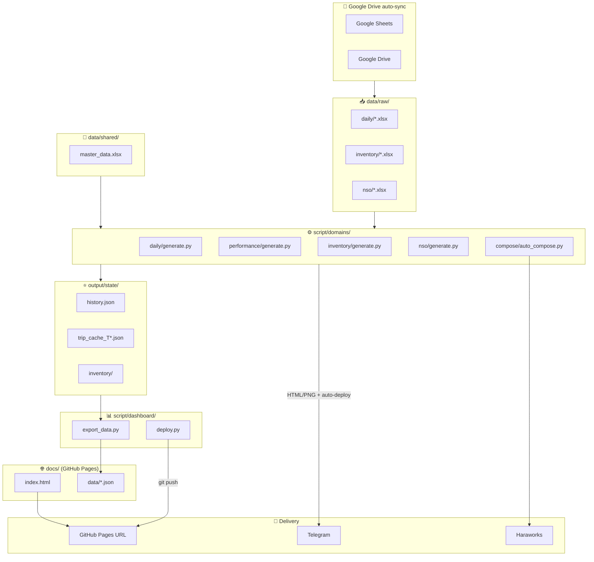

# 🏗️ Kiến Trúc Hệ Thống — Monorepo Logistics

> **File này chứa context chi tiết cho AI agent khi cần hiểu/refactor kiến trúc.**
> Quick reference → xem [README.md](../../README.md)

---

## Cấu Trúc Thư Mục

```
transport_daily_report/
│
├── .agents/workflows/          ← ENTRY POINT (slash commands)
│   ├── daily-report.md
│   ├── compose-mail.md
│   ├── backup-inject.md
│   └── performance-report.md
│
├── agents/                     ← 🧠 AI BRAIN
│   ├── role.md
│   └── prompts/                  Context chi tiết per task
│
├── script/                     ← ⚙️ CODE
│   ├── lib/                      📦 Shared library
│   │   ├── __init__.py
│   │   ├── telegram.py           Telegram send/delete (requests + urllib)
│   │   └── sources.py            Centralized data source URLs & paths
│   │
│   ├── domains/                  🏢 Domain-specific scripts
│   │   ├── daily/generate.py       Daily transport report
│   │   ├── inventory/generate.py   Inventory reconciliation (KFM vs ABA)
│   │   ├── nso/generate.py         NSO dashboard & schedule
│   │   └── performance/           Performance KPI reports
│   │       ├── generate.py
│   │       ├── fetch_weekly.py
│   │       └── fetch_monthly.py
│   │
│   ├── dashboard/                📊 Live dashboard (GitHub Pages)
│   │   ├── export_data.py          Export JSON cho web dashboard
│   │   └── deploy.py              Export + git push tự động
│   │
│   ├── orchestrator/             🎛️ Cross-domain orchestration
│   │
│   └── compose/                  📧 Email orchestration
│       ├── auto_compose.py         Orchestrator (watch + schedule)
│       ├── compose_mail.py         Generate HTML email
│       └── inject_haraworks.py     Selenium → Haraworks
│
├── docs/                       ← 🌐 GITHUB PAGES
│   ├── index.html                Dashboard SPA (4 tabs)
│   └── data/*.json               Dashboard data files
│
├── data/                       ← 📥 INPUT (auto-saved, gitignored)
│   ├── raw/{daily,inventory}/    Backups from online sources
│   ├── processed/                Cleaned data for dashboard
│   └── shared/                   Cross-domain shared data
│
├── output/                     ← 📤 OUTPUT (gitignored)
│   ├── artifacts/{daily,inventory,nso}/
│   ├── dashboard/                Multi-tab centralized dashboard
│   └── state/                    Telegram message tracking
│
├── config/                     ← ⚙️ CONFIG
│   ├── telegram.json               Daily bot config
│   ├── telegram_inventory.json     Inventory bot config
│   ├── telegram_nso.json           NSO bot config
│   ├── mail_schedule.json
│   └── auto_compose_task.xml
│
└── README.md
```

---

## Giải Thích Chi Tiết Từng Thư Mục

### 📌 `.agents/workflows/` — Điểm vào (Entry Point)

Mỗi file = 1 **slash command** cho AI agent. Khi gọi `/daily`, agent sẽ đọc `daily.md` để biết cần chạy lệnh gì, review output gì. Đây **không phải code**, mà là hướng dẫn thực thi cho agent.

### 🧠 `agents/prompts/` — Kiến thức chuyên sâu

Chứa **context chi tiết** cho AI agent hiểu domain: công thức tính KPI, cấu trúc data, edge cases, troubleshooting. Khác với workflow (hướng dẫn chạy), prompt là **kiến thức nền** để agent xử lý tình huống bất thường.

### ⚙️ `script/` — Toàn bộ code, chia 4 tầng

| Tầng | Thư mục | Vai trò | Ghi chú |
|------|---------|---------|---------| 
| **Domain** | `script/domains/` | Xử lý nghiệp vụ riêng | Mỗi domain chạy **độc lập**, không biết domain khác tồn tại |
| **Dashboard** | `script/dashboard/` | Export JSON + deploy web | Export data → git push → GitHub Pages |
| **Orchestrator** | `script/orchestrator/` | Tổng hợp kết quả | Đọc `output/state/*.json` → build dashboard |
| **Shared** | `script/lib/` | Code dùng chung | Fetch Google API, Telegram, HTML template, utils |

**Tại sao tách?**
- Thêm domain mới → chỉ tạo thêm folder trong `domains/`, không sửa code cũ
- Sửa logic fetch Google Sheets → sửa 1 chỗ trong `lib/`, tất cả domain tự cập nhật
- Orchestrator không cần biết data từ đâu, chỉ cần đọc đúng format JSON

### 📥 `data/` — Dữ liệu, chia 3 vùng

| Vùng | Thư mục | Nội dung | Ai ghi? |
|------|---------|----------|---------| 
| **Raw** | `data/raw/` | File gốc tải về (xlsx) | Domain scripts tự fetch + backup |
| **Processed** | `data/processed/` | Dữ liệu đã qua ETL | Dự phòng cho tương lai |
| **Shared** | `data/shared/` | Master data dùng chung | Cập nhật thủ công hoặc fetch |

### 📤 `output/` — Sản phẩm, chia 5 loại

| Loại | Thư mục | Nội dung | Dùng để |
|------|---------|----------|---------| 
| **Dashboard** | `output/dashboard/` | 1 file HTML nhiều tabs | Sản phẩm iframe (legacy) |
| **Artifacts** | `output/artifacts/` | PNG charts, HTML lẻ từng domain | Gửi Telegram, review nhanh |
| **State** | `output/state/` | JSON kết quả từ mỗi domain | ⭐ **Cầu nối** giữa domain → dashboard |
| **Mail** | `output/mail/` | HTML email tạm | Compose → Inject vào Haraworks |
| **Logs** | `output/logs/` | Log file | Debug, tracking |

> ⭐ **`output/state/` là trái tim kiến trúc.** Mỗi domain script ghi kết quả ra JSON. Dashboard SPA đọc tất cả JSON → render thành web. Các domain **không cần biết nhau**, chỉ cần ghi đúng format.

---

## Nguyên Tắc Thiết Kế

1. **Domain Independence** — Mỗi domain chạy độc lập, không import code từ domain khác
2. **State as Contract** — Domain giao tiếp qua JSON trong `output/state/`, không gọi nhau trực tiếp
3. **Single Source of Truth** — Master data, config, shared code chỉ có 1 bản duy nhất
4. **Backward Compatible** — Mỗi domain vẫn xuất artifacts riêng (PNG, HTML) song song với state JSON

---

## Luồng Dữ Liệu

```
Multi-source → Multi-processing → Dual delivery

Sources → data/raw/ → domains/ → output/state/*.json → dashboard/export → docs/data/*.json → GitHub Pages
                                → output/artifacts/   → Telegram
```



---

## Ví Dụ: Chạy `/daily` thì luồng đi qua folder nào?

```
BƯỚC 1 ─ Hệ thống đọc workflow (ENTRY POINT)
  📂 .agents/workflows/daily.md
  → Biết cần chạy gì, output gì, review gì

BƯỚC 2 ─ Agent đọc role + prompt
  📂 agents/role.md
  📂 agents/prompts/daily.md
  → Nguyên tắc chung + context KPI, schemas

BƯỚC 3 ─ Script fetch data → xử lý KPI
  📂 script/domains/daily/generate.py
  📂 script/lib/sources.py
  → Tải: KRC, KFM, KH MEAT, KH ĐÔNG, KH MÁT, Transfer, Yêu cầu

BƯỚC 4 ─ Xuất kết quả
  📂 output/state/history.json       ← Append snapshot (cho dashboard)
  📂 output/artifacts/daily/         ← 5 PNG + 1 HTML (cho Telegram)

BƯỚC 5 ─ Gửi Telegram
  📂 config/telegram.json
  📂 script/lib/telegram.py
  → Gửi 5 PNG + 1 HTML

BƯỚC 6 ─ Auto-deploy dashboard (tự động khi --send)
  📂 script/dashboard/deploy.py --domain daily
  → Export JSON → git push → GitHub Pages cập nhật (~1-2 phút)
```

---

## Real-time Data Connection

**Google Drive sync = realtime sẵn.** Không cần database.

```
Google Sheets / Drive
        │ (auto-sync qua Google Drive for Desktop)
        ▼
G:\My Drive\DOCS\DAILY\
├── transfer/                       ← Realtime sync
├── yeu_cau_chuyen_hang_thuong/    ← Realtime sync
        │
        ├──→ domains/daily/
        ├──→ domains/inventory/
        ├──→ domains/performance/
        └──→ domains/nso/
```

---

## Config Reference

**`config/sources.json`** — Centralized paths & IDs:

```json
{
  "shared_data": "data/shared",
  "google_sheets": {
    "krc": "1tWamqjpOI2j2MrYW3Ah6ptmT524CAlQvEP8fCkxfuII",
    "kfm": "1LkJFJhOQ8F2WEB3uCk7kA2Phvu8IskVi3YBfVr7pBx0"
  },
  "google_drive": {
    "kh_folder": "1th0myHfLtdz3uTBFf2EuQ6G1GywjufYE",
    "transfer_folder": "17Z_UPMDywWFplcg0fx3XSG87vSsG8LHb"
  },
  "local_sync": {
    "transfer": "G:\\My Drive\\DOCS\\DAILY\\transfer",
    "yeu_cau": "G:\\My Drive\\DOCS\\DAILY\\yeu_cau_chuyen_hang_thuong"
  }
}
```
