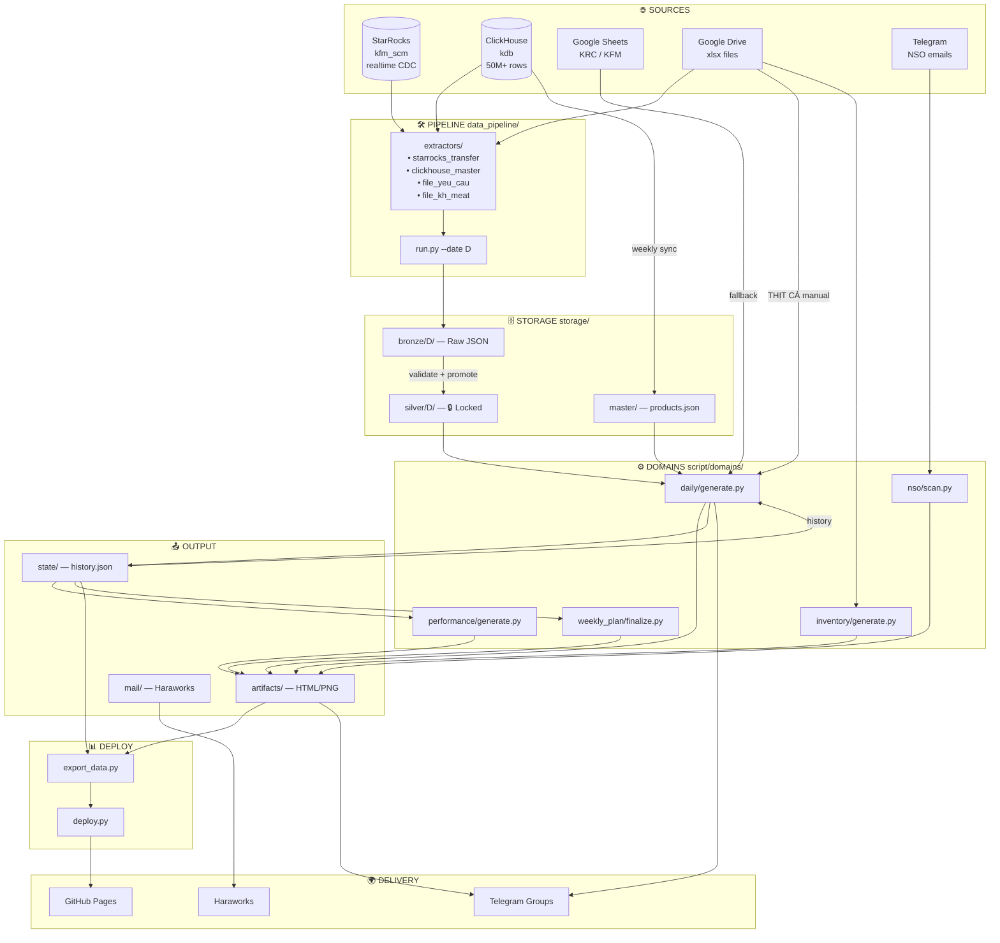
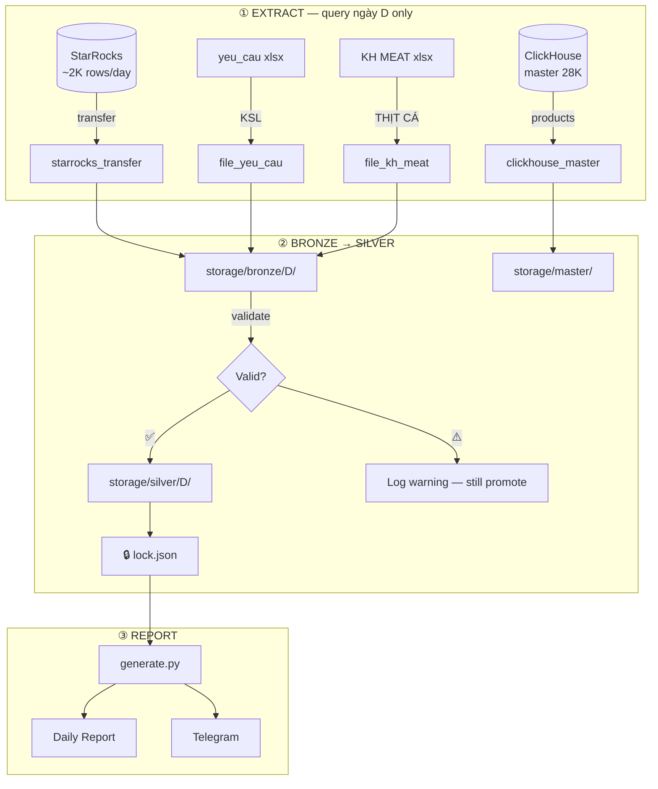
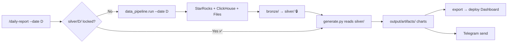
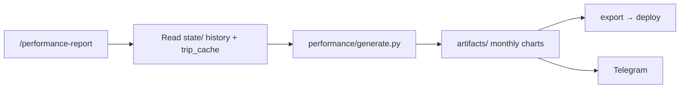
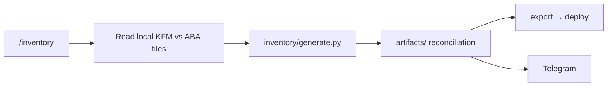
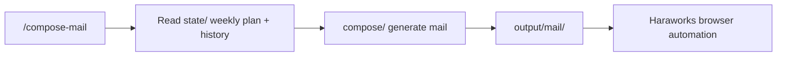

# Data Pipeline — Kiến trúc & Implementation Plan

## 1. Vision

Chuyển nguồn dữ liệu daily report từ **file/Google Sheet** sang **database** (StarRocks + ClickHouse), theo 2 phase:

| Phase | Scope | Data Source | Kho |
|---|---|---|---|
| **Phase 1** (bây giờ) | Transfer + Master Data | StarRocks + ClickHouse | ĐÔNG MÁT, KRC, KSL |
| **Phase 2** (mai mốt) | Toàn bộ trip data | StarRocks + ClickHouse | Tất cả trừ THỊT CÁ |
| **Manual** (giữ nguyên) | THỊT CÁ | File xlsx | THỊT CÁ |

---

## 2. Data Inventory

| Dữ liệu | Hiện tại | DB thay thế | Volume/ngày | Phase |
|---|---|---|---|---|
| **PT Transfer** | `transfer_*.xlsx` | StarRocks `kf_transfer_items` | ~2,100 | 1 |
| **Master Data** (barcode→weight) | Google Sheet (~8MB) | ClickHouse `kf_product_static` | 28,879 SP | 1 |
| **Yeu cau** (KSL) | `yeu_cau_*.xlsx` | ❌ Không có trên DB | ~50-100 | 1 (file) |
| **KRC schedule** | Google Sheet | ClickHouse `krc_dashboard_delivery_schedule` | ~hundreds | 2 |
| **KFM/DRY schedule** | Google Sheet | Cần verify | ~hundreds | 2 |
| **KH ĐÔNG/MÁT** | Local Drive xlsx | Cần verify | ~hundreds | 2 |
| **KH MEAT** | Local Drive xlsx | Giữ manual | ~hundreds | Manual |
| **Trip details** | — | StarRocks `kf_trips` | ~100-190 | 2 |
| **Item-level transfer** | — | ClickHouse `kf_transfer_mart` | **~100K** | 2 |

> [!WARNING]
> **Volume alert**: `kf_transfer_mart` có **50.6 triệu rows** (~100K/ngày). Phase 2 nên dùng **Parquet** thay JSON cho silver layer.

> [!IMPORTANT]
> **THỊT CÁ**: Giữ manual (file KH MEAT). Pipeline có extractor riêng cho file-based sources.

---

## 3. Cấu trúc toàn bộ thư mục

```
transport_daily_report/
│
├── .agents/workflows/               ← 🎯 ENTRY POINT (slash commands)
│   ├── daily-report.md              ←   /daily-report
│   ├── sync-and-report.md           ←   /sync-and-report 🆕
│   ├── performance-report.md        ←   /performance-report
│   ├── inventory.md                 ←   /inventory
│   ├── nso-scan.md                  ←   /nso-scan
│   ├── weekly-plan.md               ←   /weekly-plan
│   ├── compose-mail.md              ←   /compose-mail
│   ├── backup-inject.md             ←   /backup-inject
│   └── telegram-group.md            ←   /telegram-group
│
├── data_pipeline/                   ← 🛠️ MỚI: ETL Pipeline
│   ├── __init__.py
│   ├── run.py                       ←   Entry: python -m data_pipeline.run --date D
│   ├── config.py                    ←   Load DB configs
│   ├── extractors/                  ←   Pluggable extractors (1 file = 1 source)
│   │   ├── __init__.py
│   │   ├── _base.py                 ←     Base interface
│   │   ├── starrocks_transfer.py    ←     Phase 1: PT data (StarRocks)
│   │   ├── clickhouse_master.py     ←     Phase 1: barcode→weight (ClickHouse)
│   │   ├── file_yeu_cau.py          ←     Phase 1: KSL (file xlsx)
│   │   ├── file_kh_meat.py          ←     Manual: THỊT CÁ (file xlsx)
│   │   ├── starrocks_trips.py       ←     Phase 2: trip details
│   │   ├── clickhouse_transfer_mart.py ←  Phase 2: item-level (~100K/ngày)
│   │   └── clickhouse_schedules.py  ←     Phase 2: KRC/KFM schedules
│   └── validators.py               ←   Validate before lock
│
├── storage/                         ← 🗄️ MỚI: Local Data Warehouse
│   ├── .gitignore
│   ├── bronze/{DDMMYYYY}/           ←   Raw fetch (chưa validate)
│   │   ├── transfer.json
│   │   ├── yeu_cau.json
│   │   ├── kh_meat.json
│   │   └── fetch_log.json
│   ├── silver/{DDMMYYYY}/           ←   🔒 Locked & validated (report reads here)
│   │   ├── transfer.json
│   │   ├── yeu_cau.json
│   │   ├── kh_meat.json
│   │   └── lock.json
│   ├── master/                      ←   Reference data (weekly sync)
│   │   ├── products.json            ←     {barcode: weight_grams} (~500KB)
│   │   └── sync_state.json
│   └── logs/
│       └── sync_state.json
│
├── script/                          ← ⚙️ Domain Logic + Utils
│   ├── domains/                     ←   Business logic per domain
│   │   ├── daily/
│   │   │   └── generate.py          ←     Daily report (reads silver/)
│   │   ├── performance/
│   │   │   └── generate.py          ←     Monthly performance report
│   │   ├── inventory/
│   │   │   └── generate.py          ←     Inventory reconciliation
│   │   ├── nso/
│   │   │   └── scan.py              ←     NSO email scan
│   │   └── weekly_plan/
│   │       └── finalize.py          ←     Weekly transport plan
│   ├── dashboard/                   ←   Export + Deploy
│   │   ├── export_data.py           ←     JSON export for dashboard
│   │   ├── deploy.py                ←     Git push → GitHub Pages
│   │   └── export_weekly_plan.py
│   ├── compose/                     ←   Haraworks mail automation
│   ├── telegram/                    ←   Telegram bot/notifications
│   ├── lib/                         ←   Shared modules
│   │   ├── sources.py               ←     Data source URLs/paths (fallback)
│   │   └── telegram.py              ←     Telegram send helpers
│   └── orchestrator/                ←   Cross-domain (future)
│
├── config/                          ← ⚙️ Credentials & Configs
│   ├── mcp_starrocks.json           ←   StarRocks connection
│   ├── mcp_clickhouse.json          ←   ClickHouse connection
│   ├── telegram.json                ←   Telegram bot tokens
│   └── mail_schedule.json           ←   Haraworks mail schedule
│
├── data/                            ← 📥 Input data (gitignored, fallback)
│   ├── raw/daily/                   ←   Backup xlsx files
│   ├── shared/                      ←   Shared reference files
│   └── nso/                         ←   NSO data
│
├── output/                          ← 📤 Output (gitignored)
│   ├── artifacts/{domain}/          ←   HTML/PNG reports
│   ├── state/                       ←   ⭐ JSON state (cầu nối giữa domains)
│   │   ├── history.json             ←     Daily KPI history (365 days)
│   │   ├── trip_cache_T04.json      ←     Monthly trip cache
│   │   └── weekly_plan_W18.json
│   ├── mail/                        ←   Generated mail content
│   └── logs/
│
├── docs/                            ← 🌐 GitHub Pages Dashboard
│   ├── index.html
│   └── data/*.json
│
├── agents/                          ← 🧠 AI Context
│   ├── prompts/
│   ├── reference/
│   └── role.md
│
└── README.md
```

---

## 4. End-to-End Data Flow



---

## 5. Pipeline Detail: Extract → Lock → Report



---

## 6. Per-Domain Workflows

### `/daily-report` (với pipeline)



### `/performance-report`



### `/inventory`



### `/compose-mail`



---

## 7. Slash Command → Flow Mapping

| Command | Pipeline? | Domain Script | Output | Deploy |
|---|:---:|---|---|---|
| `/sync-and-report` 🆕 | ✅ `data_pipeline.run` | `daily/generate.py` | charts + KPI | Dashboard + Telegram |
| `/daily-report` | ✅ auto-fetch | `daily/generate.py` | charts + KPI | Dashboard + Telegram |
| `/performance-report` | ❌ reads state/ | `performance/generate.py` | monthly charts | Dashboard + Telegram |
| `/inventory` | ❌ reads files | `inventory/generate.py` | reconciliation | Dashboard + Telegram |
| `/nso-scan` | ❌ reads Telegram | `nso/scan.py` | NSO schedule | Dashboard + Telegram |
| `/weekly-plan` | ❌ reads state/ | `weekly_plan/finalize.py` | plan | Telegram |
| `/compose-mail` | ❌ reads state/ | `compose/` | mail | Haraworks |
| `/backup-inject` | ❌ reads state/ | `compose/` + browser | inject | Haraworks |

---

## 8. Phase 1 — Implementation Details

### 8.1 `data_pipeline/config.py`

```python
"""Load DB configs + storage paths."""
import json, os

BASE = os.path.dirname(os.path.dirname(os.path.abspath(__file__)))
STORAGE = os.path.join(BASE, "storage")
BRONZE  = os.path.join(STORAGE, "bronze")
SILVER  = os.path.join(STORAGE, "silver")
MASTER  = os.path.join(STORAGE, "master")

def load_starrocks_config(): ...
def load_clickhouse_config(): ...
```

### 8.2 Extractors

**`starrocks_transfer.py`**
- Query: `SELECT ... FROM kf_transfer_items WHERE date = D AND status = 5`
- Map `from_branch_name` → `KHO_MAP` (ĐÔNG MÁT, KRC — THỊT CÁ excluded)
- Output: `[{kho, barcode, sl, tl_grams}]`

**`clickhouse_master.py`**
- Query: `SELECT base_barcode, base_net_weight FROM kf_product_static WHERE base_net_weight > 0`
- Output: `{barcode: weight_grams}` — refresh weekly

**`file_yeu_cau.py`**
- Source: `YECAU_LOCAL` (existing), map PLO → KSL-SÁNG/TỐI
- Output: `[{kho, barcode, sl, tl_grams}]`

**`file_kh_meat.py`**
- Source: `KH_MEAT_LOCAL` (existing), kho THỊT CÁ manual
- Output: `[{kho, diem_den, tuyen}]`

### 8.3 `run.py` — Pipeline Runner

```python
"""
python -m data_pipeline.run --date 29/04/2026 [--refresh-master] [--force]
"""
def run(date_str, refresh_master=False, force=False):
    if is_locked(date_tag) and not force:
        print(f"🔒 {date_tag} already locked")
        return

    if refresh_master or master_stale(7):
        clickhouse_master.extract()
    master_tl = load_master()

    for ext in [starrocks_transfer, file_yeu_cau, file_kh_meat]:
        ext.extract(date_str, master_tl=master_tl)

    promote_to_silver(date_tag)
    lock(date_tag)
```

### 8.4 Sửa `generate.py` — Silver-first logic

```python
def load_master_data():
    path = os.path.join(STORAGE, "master", "products.json")
    if os.path.exists(path):
        return json.load(open(path))    # ← warehouse
    # Fallback: Google Sheet (unchanged)
    ...

def read_pt_data(date_str, master_tl):
    silver = os.path.join(STORAGE, "silver", date_tag)
    if os.path.exists(os.path.join(silver, "lock.json")):
        return read_from_silver(silver)  # ← warehouse
    # Fallback: file xlsx (unchanged)
    ...
```

### 8.5 Extractor Interface (extensible)

```python
# data_pipeline/extractors/_base.py
class Extractor:
    name: str       # "starrocks_transfer"
    phase: int      # 1 or 2

    def extract(self, date_str, **kwargs) -> list[dict]: ...
    def transform(self, raw_rows, master_tl) -> list[dict]: ...
```

Phase 2 chỉ cần: tạo file extractor mới → register trong `run.py` → done.

---

## 9. Phase 2 — Roadmap

| Extractor | Source | Volume/ngày | Format |
|---|---|---|---|
| `starrocks_trips.py` | StarRocks `kf_trips` | ~100-190 | JSON |
| `clickhouse_transfer_mart.py` | ClickHouse `kf_transfer_mart` | **~100K** | **Parquet** |
| `clickhouse_krc_schedule.py` | ClickHouse | ~hundreds | JSON |
| `clickhouse_kfm_schedule.py` | ClickHouse | ~hundreds | JSON |

> [!TIP]
> Phase 2 `kf_transfer_mart` (~100K rows/ngày) là lúc upgrade sang Parquet. Architecture đã extensible — chỉ thêm extractor + đổi format.

---

## 10. Retention & Cleanup

| Layer | Retention | Size estimate |
|---|---|---|
| Bronze | 7 ngày | ~150KB/ngày (P1) |
| Silver | 90 ngày | ~150KB/ngày (P1), ~5MB/ngày (P2) |
| Master | Latest only | ~500KB |
| Logs | 90 ngày | ~1KB/ngày |

---

## 11. Verification Plan

### Phase 1
1. `python -m data_pipeline.run --date 29/04/2026` → verify bronze + silver + lock
2. So sánh silver transfer vs file `transfer_29042026.xlsx` → row count + tổng tấn khớp
3. So sánh silver master vs Google Sheet → barcode overlap %
4. `generate.py --date 29/04/2026` → verify đọc silver OK
5. Xóa silver → verify fallback về file
6. `--force` → verify re-fetch

### Phase 2 (khi implement)
- So sánh ClickHouse trip data vs Google Sheet hiện tại
- Benchmark Parquet read vs JSON cho 100K rows
